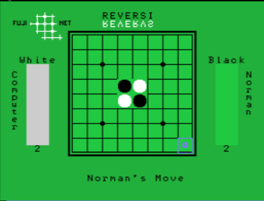

# NABU-FUN
Programs written to run on the NABU

These projects use the z88dk computer

The Makefile will work in Windows or Linux

The following environment variables need to be set for use 
with the NABU

NABEM_PATH  
    Path to your Nabu Mame emulator

NABEM_EXEC
    Name of the executible
    
NABU_CACHE  
    Where the internet adapter's store is
    
make
    create the nabu executible

make go
    copy the nabu executible to the internet adapter store and run nabu emulator

make clean
    erase all compiled code and executible

## Reversi
Classic two player game.  Either play against the computer or another opponent

